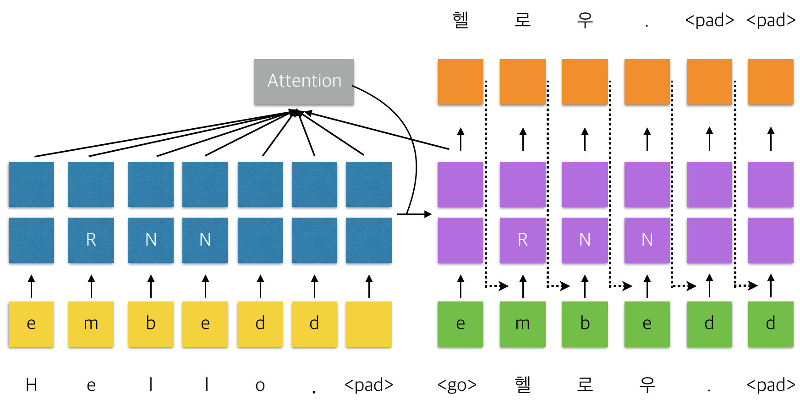
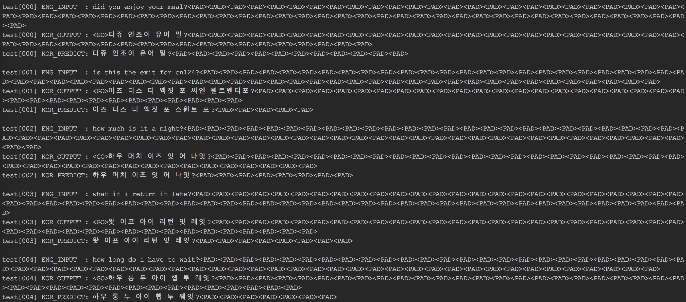
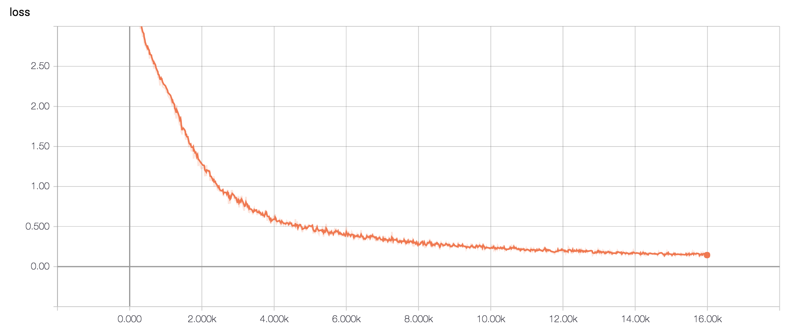
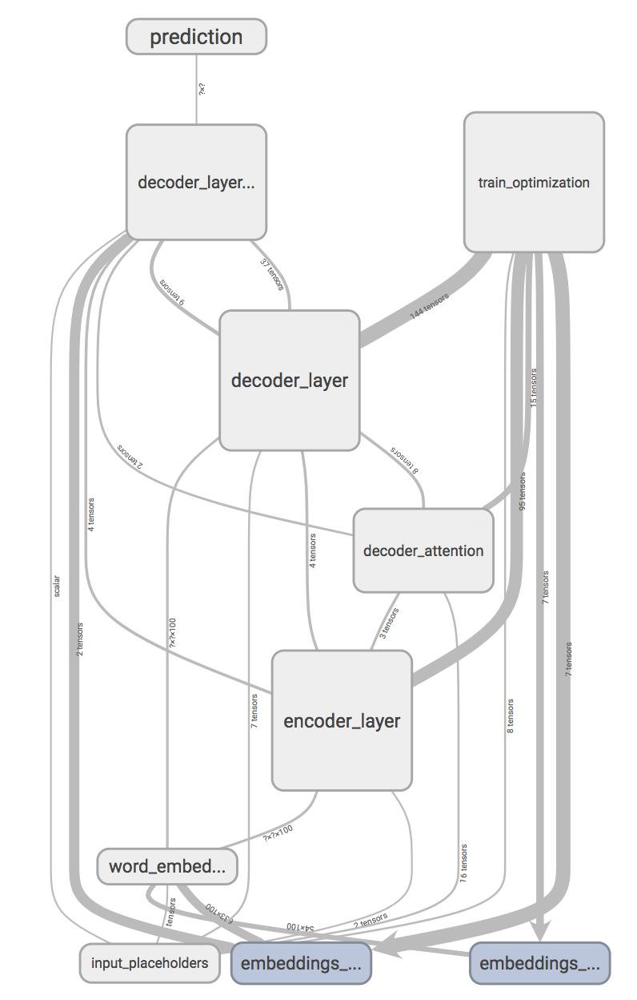

# Char-level-Neural-Machine-Translation-using-Attention-Mechanism  
### Implementation of Character level NMT(Neural Machine Translation) Model using RNN and Attention Wrapper  
### (This model converts english spelling to korean pronunciation.)  
  
#### cuteboydot@gmail.com  
  
#### reference  
1. [Learning Phrase Representations using RNN Encoder–Decoder for Statistical Machine Translation, Cho](http://emnlp2014.org/papers/pdf/EMNLP2014179.pdf)  
2. [Sequence to Sequence Learning with Neural Networks, Sutskever](https://papers.nips.cc/paper/5346-sequence-to-sequence-learning-with-neural-networks.pdf)  
  
#### data reference
1. [네이버 글로벌회화](http://phrasebook.naver.com/detail.nhn?bigCategoryNo=2&targetLanguage=en)  
  
### 1. NMT 모델 만들기.  
네이버 글로벌회화 페이지에서는 카테고리별 영어 문장을 소개하고 있다.  
총 16개의 카테고리를 다음과 같이 정리할 수 있다.  
  
0(기본표현) : Hello. Nice to meet you.  헬로우. 나이스 투 미츄.  
0(기본표현) : How are you doing?  하우 아 유 두잉?  
...  
15(긴급상황) : Your car has been towed.  유어 카 해즈 빈 토우드.  
15(긴급상황) : My car was towed, I'd like to reclaim it.  마이 카 워즈 토우드, 아잇 라익 투 리클레임 잇.  

**본 프로젝트는 영어 문장을 한글 독음으로 변환하는 내용을 다룬다.**  
**기본 입출력 데이터는 word 단위가 아닌 char 단위로 embedding matrix를 사용한다.**  
성능 향상을 위해 Multicell RNN과 Attention Mechanism을 추가하였다.  
도식화 하면 다음과 같다.  
  
  
### 2. Test result  
#### 2.1 실험 결과는 다음과 같다.  
  
  
#### 2.2 Training loss  
  
  
#### 2.3 Graph  
  